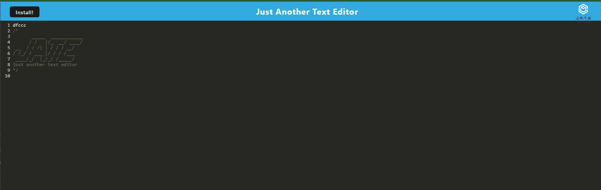

# Text Editor

## Description
A text editor that runs in a browser. A single-page application that meets PWA criteria. It will feature data persistence techniques that serve as redundancy in case one of the options is not supported by the browser. The application will also function offline.  Implemented methods for getting and storing data to an IndexedDB database using a package called idb.

## Specific Objectives
A user can create notes or code snippets with or without an internet connection so that they can be reliably retrieved for later use.

## Installation
Access the link in any web browser:
https://meredith-text-editor-17217274354d.herokuapp.com/

## Screenshots

## Link

https://meredith-text-editor-17217274354d.herokuapp.com/

## Credits
The starter code for this application was provided by Gary Almes, the instructor for the University of Minnesota Full Stack Coding Bootcamp Winter 2023-2024 Course. Thank you Gary!